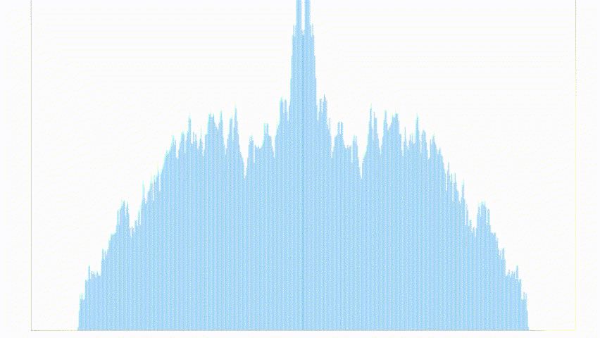

# 利用 `AnalyserNode` 展示音频频率可视化

### 原理

在 `AudioContext` 对音频进行处理的过程中，其中的 `AnalyserNode` 节点可以对音频进行频域和时域分析。正是利用了这个数据，进行可视化显示。

在`AnalyserNode`实例中获取频域数据在该实例中，利用 `getByteFrequencyData()`方法获取。其中数据值为 `Unit8Array`类型(0-255)
如果需要获取精确的频率返回，可以利用 `getFloatFrequencyData()` 返回的 0 ～ 22050 Hz 范围的频率。
与之相似的，获取时域上的数据可以利用 `getByteTimeDomainData()` 和 `getFloatDomainData()`

呈现方面，目前使用 Canvas 绘制柱状图的方式呈现。横轴方面表示当前时间节点下，该频率范围(该案例中取 0 ~ 255)。

因为获取到的频率中，低频部分的数据量过大，所以在绘制的时候，从屏幕中间开始绘制，取一半的频率进行绘制，而另外一半，采取对称显示的方式呈现。

### 演示效果：

[查看效果](https://chenkuan1110.github.com/frontend-inspiration/audio-visualization)